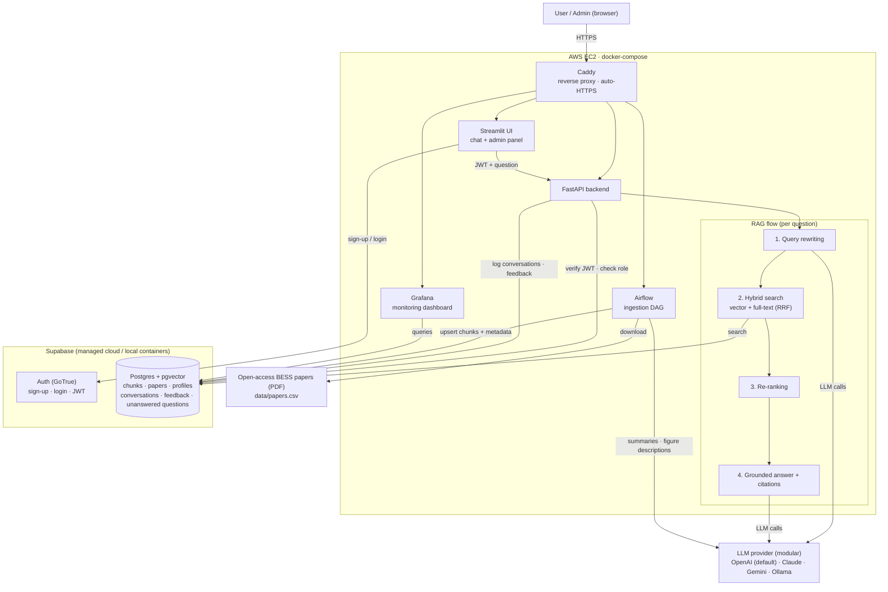
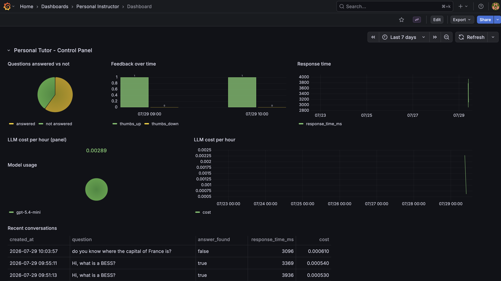

# Personal Instructor — RAG Q&A over Battery Energy Storage Systems Research

A Retrieval-Augmented Generation (RAG) application that answers questions about battery energy storage systems (BESS) based on scientific papers, with automated ingestion, hybrid search, evaluation, monitoring, and one-command deployment via docker-compose.

## Architecture



## Problem description

When you start learning a new topic — from a YouTube course, a book, software documentation, or a company knowledge base — questions come up constantly: *Where is this explained in more detail? What are the exact steps for this procedure?* Finding the answer means manually digging through hours of video or hundreds of pages.

The same problem appears in industry: technical documentation is scattered across multiple sources, so new employees struggle to find answers quickly, and experienced ones waste time searching instead of working.

**Personal Instructor** solves this with a RAG system: the user asks a question in natural language, the system retrieves the most relevant passages from the knowledge base, and an LLM generates a grounded answer with references to the source documents.

## Dataset

The knowledge base is a collection of open-access scientific papers on **battery energy storage systems (BESS)** — covering topics such as battery chemistries, sizing, grid integration, degradation, and safety.

The papers (PDF) are listed in `data/papers.csv` (title, authors, source URL, license) and downloaded automatically by the ingestion pipeline, so the dataset is fully accessible and reproducible.

<!-- TODO: finalize the paper list (~N papers), prefer open-access sources (arXiv, MDPI, Energies, journals with CC licenses) so they can be redistributed/linked -->

## Tech stack

| Component | Technology |
|---|---|
| Knowledge base / vector store | Supabase (PostgreSQL + pgvector — dense vectors + full-text search in one DB). Local runs use the `supabase/postgres` image in docker-compose; cloud runs use managed Supabase |
| Auth & access control | Supabase Auth (GoTrue) for sign-up/login (JWT verified by FastAPI) + role-based authorization (`pending` / `user` / `admin`) via a `profiles` table |
| LLM | Modular provider layer — OpenAI (default: `gpt-5.4-mini`), Anthropic Claude, Google Gemini, or local Ollama, selected via env var |
| Embeddings | <!-- TODO: e.g. text-embedding-3-small / sentence-transformers --> |
| API | FastAPI |
| UI | Streamlit |
| Ingestion orchestration | Airflow |
| Monitoring | Grafana + PostgreSQL |
| Containerization | docker-compose |
| Cloud deployment | AWS EC2 (docker-compose on a single instance, Elastic IP) + managed Supabase + Caddy for HTTPS |

## How it works

### Authentication & authorization

Sign-up/login is handled by **Supabase Auth**: the Streamlit UI calls it via `supabase-py` and stores the session; every request to FastAPI carries the user's JWT, which FastAPI verifies (signature + expiry). Without a valid session, the UI shows only the login page.

Authorization uses a `profiles` table (`user_id`, `role`) with three roles, checked by FastAPI on every request:

| Role | Access |
|---|---|
| `pending` | Can log in, but sees a "request access" message instead of answers (default on sign-up, via a trigger on `auth.users`) |
| `user` | Can query the knowledge base; their conversations and feedback are saved |
| `admin` (power user) | Everything above + the admin panel (see below) |

Role changes take effect immediately (checked per request, not baked into the JWT). Conversations and feedback are stored per user. Locally, the `supabase/auth` (GoTrue) container runs in docker-compose; in the cloud, the managed Supabase project provides it (with email confirmation and OAuth providers available).

### Admin panel (power users)

Admin-only Streamlit pages, backed by admin-only FastAPI endpoints (JWT + `role = admin` enforced server-side):

- **User management** — grant/revoke KB access, promote/demote roles, delete users.
- **Ingestion pipeline** — trigger and monitor the Airflow DAG from the panel (plus direct access to the Airflow UI).
- **Document management** — list documents in the knowledge base and delete them (removes all their chunks from the vector store).
- **Consultation logs** — every question asked and full conversation history, per user.
- **Unanswered questions (human-in-the-loop)** — when the agent can't answer from the retrieved context (low retrieval score or the LLM reports insufficient information), the question is stored in a review queue. An admin writes the answer in the panel and can approve it for **integration into the knowledge base**: the Q&A pair is chunked, embedded, and upserted into the vector store, so the agent answers it correctly from then on.
- **Monitoring dashboard** — link to Grafana (`localhost:3000`); Grafana credentials are provisioned for admins only.

### Retrieval flow

1. The user logs in and submits a question through the Streamlit UI (or calls the FastAPI endpoint with a bearer token).
2. **Query rewriting**: the LLM rewrites the user query to improve retrieval (spelling, expansion, decontextualization).
3. **Hybrid search**: the query runs against pgvector (semantic/dense) and PostgreSQL full-text search (keyword) simultaneously; results are merged with Reciprocal Rank Fusion.
4. **Re-ranking**: retrieved candidates are re-ranked (<!-- TODO: cross-encoder / LLM-based reranker -->) and the top-k passed to the LLM.
5. The LLM answers using only the retrieved context, citing sources.

### Ingestion pipeline

Fully automated with **Airflow**. A DAG reads `data/papers.csv` (filename/URL, title, authors, year) and, per paper:

1. Downloads the PDF (idempotent — already-ingested papers are skipped).
2. Extracts text and figures with a layout-aware parser.
3. Cleans the text (headers/footers, references section).
4. Generates a paper **summary** with the LLM and stores paper metadata in a `papers` table.
5. **Figure understanding**: each extracted figure + caption is described by a vision LLM; descriptions are indexed as searchable chunks (tagged with paper, figure number, page).
6. Chunks the text (section-aware), computes embeddings, and upserts everything into pgvector with `paper_id` metadata for citations.

Runs on a schedule and can be triggered manually from the Airflow UI (`localhost:8080`) or the admin panel. A second, lightweight path ingests admin-approved answers from the unanswered-questions queue (already clean: chunk → embed → upsert).

<!-- TODO: PDF parser (e.g., docling/PyMuPDF), chunking parameters, DAG names -->

## Evaluation

### Retrieval evaluation

Multiple retrieval approaches are evaluated on a ground-truth dataset of question–document pairs, using Hit Rate and MRR:

| Approach | Hit Rate | MRR |
|---|---|---|
| Text search (full-text) | 0.731 | 0.532 |
| Vector search (pgvector) | 0.788 | 0.626 |
| Hybrid (RRF) | 0.802 | 0.621 |
| Hybrid + re-ranking | TODO | TODO |

Chunking strategies are also compared as retrieval approaches, on the same question set: **structural** (section-aware, current default) vs **semantic** (split where embedding similarity between adjacent windows drops) vs **SLM-validated** (a small LM judges whether adjacent chunks share meaning or require a split).

The best-performing approach (**TODO**) is used in the application. Notebook/script: `evaluation/retrieval_eval.ipynb` <!-- TODO -->

### LLM (RAG) evaluation

Multiple prompts/models are evaluated using <!-- TODO: LLM-as-a-judge / cosine similarity vs. ground truth answers -->:

| Approach | RELEVANT | PARTLY | NON | answer_found |
| --- | --- | --- | --- | --- |
| v1 (grounded, plain) | 82.7% | 16.7% | 0.7% | 96.0% |
| v2 (instructor-styled) | 77.3% | 20.7% | 2.0% | 96.0% |
| gpt-5.4-mini vs. TODO | TODO | TODO | TODO | TODO |

The best approach (**TODO**) is used in the application.

## Monitoring

User feedback (👍/👎) is collected in the UI and stored in PostgreSQL along with every conversation (user, question, answer, model, tokens, cost, response time, relevance). The Grafana dashboard is available to admins.

A **Grafana dashboard** (`localhost:3000`) includes at least 5 charts:

1. Answer relevance distribution
2. User feedback (thumbs up/down over time)
3. Response time
4. Token usage / OpenAI cost
5. Model usage breakdown
6. Recent conversations table



## How to run it

### Prerequisites

- Docker & docker-compose
- An OpenAI API key (or Anthropic/Gemini key, or local Ollama)

### 1. Configure environment

```bash
cp .env.example .env
# edit .env and set:
#   OPENAI_API_KEY            (and optionally LLM_PROVIDER / LLM_MODEL)
#   DATABASE_URL              (defaults to the local supabase/postgres container;
#                              point it to your Supabase project for cloud mode)
#   SUPABASE_URL, SUPABASE_ANON_KEY, SUPABASE_JWT_SECRET   (auth)
```

### 2. Start everything

```bash
docker-compose up -d
```

This starts: Supabase Postgres (pgvector), Supabase Auth (GoTrue), FastAPI backend, Streamlit UI, Airflow, and Grafana — fully local, no cloud account needed.

### 3. Run the ingestion

```bash
# Trigger the Airflow DAG (or wait for the schedule)
# TODO: exact command or UI instructions
```

### 4. Use the app

- UI: http://localhost:8501
- API docs: http://localhost:8000/docs
- Airflow: http://localhost:8080
- Grafana: http://localhost:3000

### API example

```bash
curl -X POST http://localhost:8000/ask \
  -H "Content-Type: application/json" \
  -H "Authorization: Bearer <supabase-access-token>" \
  -d '{"question": "What is the procedure for ...?"}'
```

<!-- TODO: verify endpoint name and payload -->

### Dependency versions

All Python dependencies are pinned in `requirements.txt` / `pyproject.toml`; service versions are pinned in `docker-compose.yaml`.

## Cloud deployment

- **Database + Auth**: managed Supabase project (free tier).
- **App services**: a single AWS EC2 instance (t3.medium, Ubuntu) running the same `docker-compose.yaml` as local — deploy is `git clone`, fill `.env` (pointing `DATABASE_URL` at Supabase), `docker-compose up -d`.
- **URL / HTTPS**: Elastic IP + Caddy in docker-compose as reverse proxy with automatic Let's Encrypt TLS (`.dev` enforces HTTPS browser-side). Subdomains, all A records to the same Elastic IP:
  - `personalinstructor.jesusvega.dev` → Streamlit UI
  - `api.personalinstructor.jesusvega.dev` → FastAPI
  - `airflow.personalinstructor.jesusvega.dev` / `grafana.personalinstructor.jesusvega.dev` → admin UIs (behind their own logins)

Live app: https://personalinstructor.jesusvega.dev <!-- TODO: confirm once deployed; add screenshots -->

## Project structure

```
.
├── app/            # FastAPI backend + RAG logic (search, rerank, rewrite, LLM providers)
├── ui/             # Streamlit frontend
├── ingestion/      # Airflow DAGs
├── evaluation/     # Retrieval & LLM evaluation notebooks + ground truth data
├── grafana/        # Dashboard config
├── data/           # Source documents
├── docker-compose.yaml
└── README.md
```

<!-- TODO: keep this in sync with the actual repo layout -->
