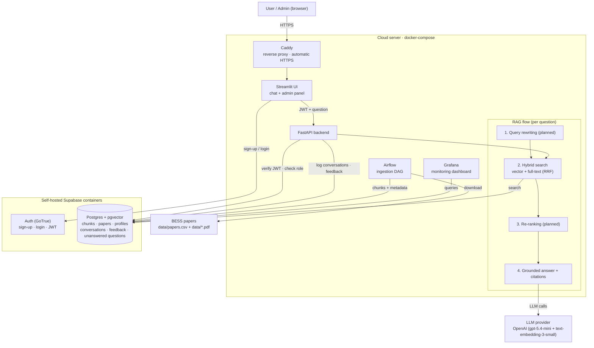

# Personal Instructor — RAG Q&A over Battery Energy Storage Systems Research

A Retrieval-Augmented Generation (RAG) application that answers questions about battery energy storage systems (BESS) from a corpus of scientific papers, with authenticated access, an admin panel for managing the knowledge base, automated ingestion, hybrid search, evaluation, monitoring, and containerized deployment via docker-compose.

## Live

| | |
|---|---|
| **App** | <https://personalinstructor.jesusvega.dev> |
| API docs | <https://api.personalinstructor.jesusvega.dev/docs> |
| Grafana | <https://grafana.personalinstructor.jesusvega.dev> *(own login)* |
| Airflow | <https://airflow.personalinstructor.jesusvega.dev> *(own login)* |

### Try it

A shared demo account is open to anyone — no sign-up needed:

| | |
|---|---|
| Email | `emailfortrial@email.com` |
| Password | `Test1234` |

It holds the `user` role, so it can ask questions, see the retrieved sources
and leave 👍/👎 feedback. The admin panel — document upload, editing, deletion
and role changes — is not reachable from it.

If you'd rather have your own account, sign-ups land in the `pending` role and
need approval before they can ask anything.

Running on a single Hetzner CX23 (2 vCPU / 4 GB, ~€6/month) behind Caddy, which
obtains and renews the Let's Encrypt certificates itself.

## Project status

The end-to-end system is deployed and running: sign up / log in, ask questions, get grounded cited answers, give feedback, and manage the knowledge base from an admin panel; conversations, feedback, and unanswered questions are logged, and a Grafana dashboard visualizes them.

## Architecture

The diagram shows the **target** architecture; the boxes marked *planned* — query rewriting, re-ranking, and figure understanding — are not built yet.



## Problem description

When you start learning a new topic — from a course, a book, software documentation, or a company knowledge base — questions come up constantly: *Where is this explained in more detail? What are the exact steps for this procedure?* Finding the answer means manually digging through hundreds of pages.

The same problem appears in industry: technical documentation is scattered across multiple sources, so new employees struggle to find answers quickly, and experienced ones waste time searching instead of working.

**Personal Instructor** solves this with a RAG system: the user asks a question in natural language, the system retrieves the most relevant passages from the knowledge base, and an LLM generates a grounded answer with references to the source documents.

## Dataset

The knowledge base is a collection of open-access papers on **battery energy storage systems (BESS)** — covering battery chemistries, sizing, grid integration, degradation, cost (LCOS), and communication protocols. The corpus currently holds **10 documents / ~408 chunks**.

Every document is recorded in **`data/papers.csv`** (`filename, title, authors, year, source_url, license`), which is the reproducible source of truth for the corpus. The ingestion pipeline downloads any paper that has a `source_url` and isn't already present; documents without a public URL live directly in `data/`. See [Managing the knowledge base](#managing-the-knowledge-base) below.

## Tech stack

| Component | Technology |
|---|---|
| Knowledge base / vector store | Supabase Postgres + pgvector (dense vectors + full-text search in one DB). Local runs use the `supabase/postgres` container |
| Auth & access control | Supabase Auth (GoTrue), JWT verified by FastAPI (`pyjwt`, HS256) + role-based authorization (`pending`/`user`/`admin`) via a `profiles` table |
| LLM | OpenAI — `gpt-5.4-mini` for generation, `text-embedding-3-small` (1536-dim) for embeddings, selected via env vars (modular multi-provider layer planned) |
| API | FastAPI + Uvicorn |
| UI | Streamlit |
| Ingestion orchestration | Airflow (standalone) |
| Monitoring | Grafana over Postgres |
| Containerization | docker-compose (`uv`-based images) |
| Cloud deployment | Single cloud server (Hetzner) + Caddy for automatic HTTPS |

## How it works

### Authentication & authorization

Sign-up/login is handled by **Supabase Auth (GoTrue)**: the Streamlit UI calls GoTrue's REST API (via `requests`) server-side and stores the returned JWT in the session. Every request to FastAPI carries the JWT in an `Authorization: Bearer` header, which FastAPI verifies (signature + expiry + `aud`) using the shared `SUPABASE_JWT_SECRET`. Without a valid token, the UI shows only the login page.

Authorization uses a `profiles` table (`user_id`, `email`, `role`) with three roles, checked by FastAPI on every request (not baked into the JWT, so changes take effect immediately):

| Role | Access |
|---|---|
| `pending` | Can log in, but sees a "pending admin approval" message instead of answers (default on sign-up, via a trigger on `auth.users`) |
| `user` | Can query the knowledge base; conversations and feedback are saved per user |
| `admin` | Everything above + the admin panel |

A DB trigger (`on_auth_user_created`) auto-creates a `pending` profile for every new signup. The first admin is promoted once by hand (see run instructions); after that, admins manage roles from the panel. Admins cannot change their own role (guarded in both UI and API) to prevent self-lockout.

### Admin panel

Admin-only Streamlit tabs, backed by admin-only FastAPI endpoints (`role = admin` enforced server-side on the whole `/admin` router):

- **Users** — list users and change roles (`pending`/`user`/`admin`).
- **Documents (upload / edit / delete)** — see [Managing the knowledge base](#managing-the-knowledge-base).
- **Review queue (human-in-the-loop)** — when the agent can't answer from the retrieved context (the LLM sets `answer_found = false`), the question is stored in a review queue. An admin writes the answer, and on submit the Q&A pair is embedded and upserted into the vector store (`kind = 'qa'`), so the agent answers it correctly from then on.
- **Monitoring** — Grafana dashboard (admins only).

### Retrieval flow

1. The user submits a question through the Streamlit UI (or calls `POST /ask` with a bearer token).
2. **Hybrid search**: the question is embedded and run against pgvector (dense/semantic) and Postgres full-text search (keyword) in parallel; the two result lists are merged with Reciprocal Rank Fusion (`RRF_K = 60`).
3. The top-k chunks are passed to the LLM, which answers **using only the retrieved context**, returns structured output (`answer`, `answer_found`, `citations`), and cites the context blocks it used.
4. The conversation (question, answer, model, tokens, cost, latency, top retrieval score, `answer_found`) is logged; if `answer_found` is false, the question is queued for review.

*Query rewriting (step before search) and re-ranking (step after search) are planned; the evaluation harness already supports comparing them.*

### Ingestion pipeline

The pipeline (`ingestion/`) processes one document at a time: **parse → clean → chunk → embed → load**.

1. **Parse** (`parser.py`): PDFs via PyMuPDF (layout-aware, per-page); text formats (`.txt`, `.md`, `.csv`, `.json`) read directly.
2. **Clean** (`cleaner.py`): remove repeated headers/footers, one-off journal front matter, and the references section.
3. **Chunk** (`chunker.py`): section-aware, ~800-token chunks with ~100-token overlap; tiny fragments dropped.
4. **Embed** (`embedder.py`): `text-embedding-3-small`, batched.
5. **Load** (`loader.py`): upsert paper + chunks into Postgres. **Idempotent** — a paper already present (by filename) is skipped *before* any parsing/embedding, so re-runs and the scheduled DAG cost nothing.

Two entry points feed the same core (`ingest_file`):
- **Airflow DAG** (`dags/ingest_papers.py`): `download` (fetch manifest papers with URLs) → `ingest` (all manifest papers not yet loaded). Scheduled `@daily`, also triggerable from the Airflow UI.
- **Admin upload** (see below): interactive single-document ingestion with reviewed metadata.

*LLM paper summaries and figure understanding (vision LLM) are planned; the schema reserves a `summary` column and `kind='figure'` chunks.*

## Managing the knowledge base

Documents are managed in three ways, all sharing the same ingestion core and keeping `data/papers.csv` in sync.

### 1. Admin upload (UI)

In the admin panel's **Upload** tab, an admin uploads a file (PDF, TXT, MD, CSV, JSON). This is a **two-step, review-before-ingest** flow:

1. **Upload** → `POST /admin/upload` saves the file to `data/`, parses it, and uses the LLM to **propose metadata** (title, authors, year) from the document's opening text (`ingestion/metadata.py`). Nothing is ingested yet.
2. **Review & edit** → the proposed values pre-fill an editable form; the admin corrects/completes any field (including `source_url`).
3. **Ingest** → `POST /admin/ingest` runs the pipeline with the reviewed metadata and appends the row to `data/papers.csv`.

### 2. Edit existing document metadata (UI)

In the **Documents** tab, each paper expands into an editable form (title, authors, year, source_url). Saving calls `PUT /admin/documents/{id}` — a **metadata-only** update (no re-chunk/re-embed, since the text is unchanged) that also updates the manifest.

### 3. Delete documents (UI)

The Documents tab's delete action calls `DELETE /admin/documents/{id}`, removing the paper and all its chunks from the vector store (via `ON DELETE CASCADE`).

### Files & layout on disk

- `data/papers.csv` — the manifest (source of truth for the corpus).
- `data/*.pdf`, `data/*.txt`, … — the source documents. Mounted into the `api` and `airflow` containers so uploads and the DAG share the same files.
- `data/interim/` — intermediate parsed/cleaned text (git-ignored, regenerable).

Bulk/manifest ingestion from the CLI:

```bash
uv run python -m ingestion.run                 # ingest all manifest papers (idempotent)
uv run python -m ingestion.downloader          # download manifest papers that have a source_url
```

## Evaluation

### Retrieval evaluation

Retrieval approaches were evaluated on a ground-truth set of 784 question–chunk pairs (generated per chunk by an LLM; `evaluation/generate_ground_truth.py`), using Hit Rate@5 and MRR (`evaluation/retrieval_eval.py`):

| Approach | Hit Rate | MRR |
|---|---|---|
| Text search (full-text) | 0.731 | 0.532 |
| Vector search (pgvector) | 0.788 | 0.626 |
| **Hybrid (RRF)** | **0.802** | 0.621 |

**Hybrid (RRF) is the default** — it maximizes Hit Rate (whether the answer is in the context at all, which matters most for RAG) at a negligible MRR cost.

### LLM (RAG) evaluation

Answer quality was evaluated with an LLM-as-judge (relevance classification over a 150-question sample; `evaluation/rag_eval.py`):

| Prompt | RELEVANT | PARTLY | NON | answer_found |
|---|---|---|---|---|
| **v1 (grounded, plain)** | **82.7%** | 16.7% | 0.7% | 96.0% |
| v2 (instructor-styled) | 77.3% | 20.7% | 2.0% | 96.0% |

**Prompt v1 is the default.** The more elaborate v2 (persona + mandated structure + figure-quoting) traded answer completeness for format and scored lower. Model-vs-model comparison is pending.

## Monitoring

Every conversation is logged to Postgres (user, question, answer, model, tokens, cost, response time, top retrieval score, `answer_found`), and 👍/👎 feedback is collected in the UI. A **Grafana dashboard** (`localhost:3000`, provisioned from `grafana/`) visualizes:

1. Answered vs unanswered questions
2. Feedback (👍/👎) over time
3. Response time
4. LLM cost over time (+ total)
5. Model usage breakdown
6. Recent conversations table

<!-- TODO: add docs/grafana-dashboard.png screenshot -->

## How to run it

### Prerequisites

- Docker & docker-compose
- An OpenAI API key

### 1. Configure environment

```bash
cp .env.example .env
# edit .env and set at least:
#   OPENAI_API_KEY
#   POSTGRES_PASSWORD        (default: postgres)
#   SUPABASE_JWT_SECRET      (generate: openssl rand -base64 48)
#   GRAFANA_PASSWORD         (default: admin)
```

### 2. Start everything

```bash
docker compose up -d          # db, auth, api, ui, airflow, grafana
```

### 3. Bootstrap the database (first run only)

Applies the schema, sets the GoTrue DB-role password, and installs the auth FK + signup trigger (idempotent):

```bash
./scripts/bootstrap_db.sh
```

### 4. Create your admin account

1. Open the UI (http://localhost:8501) and **sign up** — new users start as `pending`.
2. Promote yourself to admin:

```bash
docker exec pi-db psql -U postgres -c \
  "UPDATE profiles SET role='admin' WHERE email='you@example.com';"
```

### 5. Ingest the corpus

`data/*.pdf` is gitignored, so a fresh clone has the manifest
(`data/papers.csv`) but none of the documents. Either fetch them from the
manifest URLs, or drop your own copies into `data/` first:

```bash
uv run python -m ingestion.downloader    # optional: fetch missing PDFs
uv run python -m ingestion.run           # ingest whatever is in data/
```

`ingestion.run` globs `data/*.pdf`; with none present it exits 0 without
printing anything. The `ingest_papers` Airflow DAG chains both steps
(`download() >> ingest()`) and can be triggered at http://localhost:8080.

### 6. Use the app

- UI: http://localhost:8501
- API docs: http://localhost:8000/docs
- Airflow: http://localhost:8080
- Grafana: http://localhost:3000

### API example

```bash
TOKEN=$(curl -s -X POST 'http://localhost:9999/token?grant_type=password' \
  -H 'Content-Type: application/json' \
  -d '{"email":"you@example.com","password":"..."}' | python3 -c "import sys,json;print(json.load(sys.stdin)['access_token'])")

curl -X POST http://localhost:8000/ask \
  -H "Content-Type: application/json" -H "Authorization: Bearer $TOKEN" \
  -d '{"question": "What factors drive the LCOS of a battery storage system?"}'
```

### Dependency versions

Python dependencies are pinned in `pyproject.toml` / `uv.lock`; service and image versions are pinned in `docker-compose.yaml` and the `docker/*.Dockerfile` files.

## Cloud deployment

The whole stack runs on a single small cloud server using the same images as
local, plus a `docker-compose.prod.yaml` overlay. **Full runbook:
[`docs/deploy.md`](docs/deploy.md)** (written for Hetzner Cloud, but it's just
Docker on Ubuntu — the same steps work on EC2, GCE or DigitalOcean).

The overlay does three things:

1. Adds **Caddy** as a reverse proxy, terminating HTTPS with automatic Let's Encrypt certificates (`docker/Caddyfile`).
2. **Un-publishes every other service's host ports**, so nothing is reachable except through Caddy. This matters most for Postgres, which the base file exposes on `5432` for local convenience and which must never be open on a public host.
3. Rewrites the `localhost` URLs the services advertise (GoTrue, Airflow, Grafana) to their public ones, and sets `restart: unless-stopped` throughout.

Subdomains, all A records pointing at the server's IP — **DNS only, not proxied**, so Caddy can complete its own Let's Encrypt validation:

| Host | Service |
|---|---|
| `personalinstructor.jesusvega.dev` | Streamlit UI |
| `api.personalinstructor.jesusvega.dev` | FastAPI |
| `auth.personalinstructor.jesusvega.dev` | GoTrue — token endpoint for API clients |
| `airflow.personalinstructor.jesusvega.dev` | Airflow UI (own login) |
| `grafana.personalinstructor.jesusvega.dev` | Grafana (own login) |

The browser only ever talks to the UI: Streamlit calls the API and GoTrue
server-side over the internal Docker network. `auth.` is published solely so API
clients can exchange credentials for a JWT.

```bash
# on the instance, after setting DOMAIN and ACME_EMAIL in .env
docker compose -f docker-compose.yaml -f docker-compose.prod.yaml up -d --build
./scripts/bootstrap_db.sh
```

Local development is unaffected — plain `docker compose up -d` still publishes
every port and needs neither a domain nor certificates. Requires Docker Compose
≥ 2.24 (for the `!override` tag).

## Improvement opportunities

Where this goes next, roughly in order of what would move the numbers most.

### Retrieval quality

**Query rewriting and re-ranking.** The two stages the RAG flow reserves but
doesn't yet implement. Rewriting would expand a terse question before search;
re-ranking would reorder the fused results before they reach the prompt. The
evaluation harness already compares approaches on Hit Rate and MRR, so both can
be measured against the 0.802 the current hybrid retrieval reaches rather than
adopted on faith.

**Chunking-strategy comparison.** Chunks are currently section-aware with fixed
bounds. Sizes, overlap and split points all affect retrieval, and the
ground-truth set of 784 question–chunk pairs is large enough to tell the
difference between strategies rather than guess at it.

### Answer quality

**A stricter `answer_found` flag.** In production the flag returns `true` for
questions the corpus can't possibly answer — a bare greeting is scored as
answered. That inflates the answered/unanswered ratio on the dashboard and, more
usefully, means genuinely unanswerable questions never reach the review queue
they were built for.

**Cleaner text extraction.** Some chunks carry mojibake from PDF font encodings
(a ligature surfacing as Armenian characters mid-word), which then appears
verbatim in answers. A Unicode filter in `ingestion/cleaner.py` would catch it
at ingestion rather than at display.

**Paper summaries and figure understanding.** The schema already reserves a
`summary` column and `kind='figure'` chunks. Summarising each paper at ingestion
would give retrieval a document-level signal to complement the chunk-level one;
a vision model over figures would reach content that text extraction cannot.

### Architecture

**A modular LLM provider layer.** Generation and embeddings both call OpenAI
directly. Putting a provider interface in front would allow Claude, Gemini or a
local Ollama model behind the same code — and would turn the model-vs-model
comparison from a rewrite into a config change.

**Triggering the ingestion DAG from the admin panel.** Uploading a document and
running the pipeline are currently separate places (the admin panel and the
Airflow UI). The DAG already exposes a REST trigger.

## Project structure

```
.
├── app/            # FastAPI backend: main, auth, admin, search, rag, history
├── ui/             # Streamlit frontend (chat + admin panel)
├── ingestion/      # parse, clean, chunk, embed, load, manifest, downloader, metadata
├── dags/           # Airflow DAG (ingest_papers)
├── common/         # config (settings) + db connection
├── evaluation/     # ground-truth generator + retrieval/RAG eval scripts + data
├── migrations/     # init.sql (schema) + 002_auth.sql (auth FK/trigger)
├── grafana/        # provisioned datasource + dashboard
├── scripts/        # bootstrap_db.sh
├── docker/         # app.Dockerfile, airflow.Dockerfile, Caddyfile
├── docs/           # deploy.md runbook + dashboard screenshot
├── data/           # papers.csv manifest + source documents
├── docker-compose.yaml       # local: every service publishes its port
├── docker-compose.prod.yaml  # cloud overlay: Caddy + HTTPS, ports closed
└── README.md
```

## Contact

Questions about the app, the architecture, or the deployment — happy to hear from you:

| | |
|---|---|
| Portfolio | <https://jesusvega.dev> |
| WhatsApp | [jesusvega.dev](https://wa.me/jesusvega.dev) |
| LinkedIn | [jesus-vega-data](https://www.linkedin.com/in/jesus-vega-data/) |
| Email | jesus.vega.ingenieria@outlook.com |

Built by **Jesús Vega** as the capstone for the
[DataTalksClub LLM Zoomcamp](https://github.com/DataTalksClub/llm-zoomcamp).
